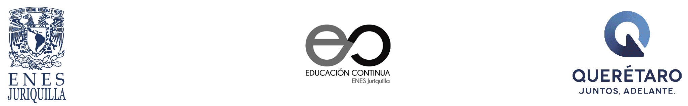

  # Ciencia de Datos e Inteligencia Artificial

---

---

## **Fechas de capacitación:** 

#### Parte I: 
      18 de junio al 01 de agosto de 2024

#### Parte II: 
      Por definir

## **Responsable:** 
* Dr. Ulises Olivares Pinto  

## **Invitados:** 
* Walter André Hauri Rosales  

## Objetivo General
Capacitar al personal de dependencias gubernamentales en la comprensión, diseño e implementación de soluciones basadas en inteligencia artificial (IA) con el fin de mejorar la eficiencia, eficacia y calidad de los servicios públicos. El curso brindará una base teórica sólida, conocimientos prácticos sobre herramientas y tecnologías de IA y experiencia en la aplicación de IA para abordar desafíos reales dentro del sector público.

## Objetivos Específicos
- Proporcionar una comprensión profunda de los conceptos fundamentales de la inteligencia artificial, incluyendo su historia, principales técnicas y aplicaciones.
- Examinar los principios éticos y consideraciones de privacidad en el uso de IA, con especial énfasis en su aplicación en el sector público.
- Capacitar a los participantes en el uso de herramientas y plataformas líderes para el desarrollo de soluciones de IA, incluyendo la programación en Python y el uso de bibliotecas especializadas como TensorFlow, Pandas, SciPy y Scikit-learn, entre otras.
- Guiar a los participantes en la organización, depuración y visualización de datos, habilidades cruciales para el desarrollo efectivo de proyectos de IA.
- Fomentar la identificación de oportunidades para aplicar la IA en la mejora de servicios gubernamentales mediante el análisis y discusión de casos de estudio reales y pertinentes.

## **Modalidad:** 

Presencial / En línea

## **Prerrequisitos:** 
+ Computadora personal con acceso a internet
+ Cuenta de Gmail
+ Conocimientos básicos de programación.

## Contenido Temático

| Día                    | Horas               | Tema                                       | Subtemas                                                                                                                                                                                                                                 | Materiales                                     |
|------------------------|---------------------|--------------------------------------------|-----------------------------------------------------------------------------------------------------------------------------------------------------------------------------------------------------------------------------------------|--------------------------------------------------------|
| Martes, 18 de junio    | 3 horas (virtual)   | Introducción General a la IA               | <ul><li>Definición de Inteligencia Artificial</li><li>Historia de la IA</li><li>Impacto de la IA en diferentes sectores</li><li>Relación entre IA y Python</li><li>Casos de uso de Python en proyectos de IA</li></ul>                   |                                                        |
| Miércoles, 19 de junio | 4 horas (presencial)| Fundamentos de Python                      | <ul><li>Historia y características de Python</li><li>Instalación de Python y configuración del entorno</li><li>Primeros pasos en Python</li><li>Sintaxis básica y estructura de un programa Python</li></ul>                              |                                                        |
| Jueves, 20 de junio    | 3 horas (virtual)   | Fundamentos de Python y Tipos de Datos y Operadores | <ul><li>Sintaxis básica y estructura de un programa Python (continuación)</li><li>Estructura de control básica (if, else)</li><li>Bucles básicos (for, while)</li></ul> <ul><li>Tipos de datos primitivos</li><li>Operadores aritméticos, relacionales y lógicos</li><li>Conversiones de tipos de datos</li><li>Ejercicios prácticos</li></ul>  |                                                        |
| Martes, 25 de junio    | 3 horas (virtual)   | Tipos de Datos y Operadores (continuación) | <ul><li>Tipos de datos primitivos (continuación)</li><li>Operadores aritméticos, relacionales y lógicos (continuación)</li><li>Conversiones de tipos de datos (continuación)</li><li>Ejercicios prácticos</li></ul>                         |                                                        |
| Miércoles, 26 de junio | 4 horas (presencial)| Estructuras de Control de Flujo            | <ul><li>Sentencias condicionales: if, elif, else</li><li>Bucles: while, for</li><li>Control de flujo avanzado: break, continue, pass</li><li>Ejercicios prácticos</li></ul>                                                               |                                                        |
| Jueves, 27 de junio    | 3 horas (virtual)   | Estructuras de Control de Flujo (continuación) y Funciones y Módulos | <ul><li>Control de flujo avanzado: break, continue, pass (continuación)</li><li>Ejercicios prácticos (continuación)</li></ul> <ul><li>Definición y uso de funciones</li><li>Parámetros y retorno de valores</li><li>Funciones lambda</li></ul> |                                                        |

#### Última modificación: 18 de junio de 2024
